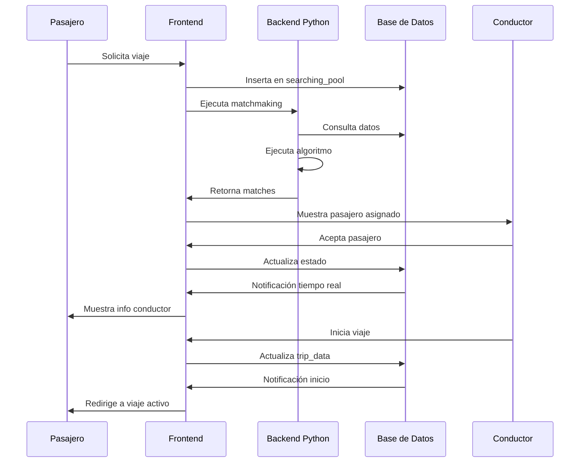

# Arquitectura del Sistema de Carpooling WHEELS: Un Análisis Técnico Completo

## Resumen Ejecutivo

WHEELS es una aplicación de carpooling desarrollada con una arquitectura moderna que combina tecnologías frontend y backend para facilitar el emparejamiento inteligente entre conductores y pasajeros. El sistema implementa un algoritmo de emparejamiento basado en proximidad geográfica, optimización de rutas y comunicación en tiempo real, utilizando una arquitectura de microservicios que integra React, Python, PostgreSQL y Supabase.

## 1. Arquitectura General del Sistema

### 1.1 Visión de Alto Nivel

El sistema WHEELS sigue una arquitectura de tres capas con los siguientes componentes principales:

```
┌─────────────────────────────────────────────────────────────┐
│                    CAPA DE PRESENTACIÓN                    │
│  React Frontend (Vite + TypeScript + Tailwind CSS)        │
│  • Interfaz de usuario responsiva                         │
│  • Gestión de estado con Context API                      │
│  • Comunicación en tiempo real                            │
└─────────────────────────────────────────────────────────────┘
                                │
                                ▼
┌─────────────────────────────────────────────────────────────┐
│                    CAPA DE LÓGICA                          │
│  Python Flask API + Supabase Functions                    │
│  • Algoritmo de emparejamiento inteligente                 │
│  • Integración con Google Maps API                        │
│  • Procesamiento de datos en tiempo real                  │
└─────────────────────────────────────────────────────────────┘
                                │
                                ▼
┌─────────────────────────────────────────────────────────────┐
│                    CAPA DE DATOS                           │
│  PostgreSQL (Supabase) + Row Level Security               │
│  • Almacenamiento relacional optimizado                   │
│  • Triggers y funciones almacenadas                       │
│  • Replicación en tiempo real                             │
└─────────────────────────────────────────────────────────────┘
```

### 1.2 Componentes Principales

1. **Frontend (React)**: Interfaz de usuario moderna y responsiva
2. **Backend Python**: Servicio de emparejamiento y optimización
3. **Base de Datos**: PostgreSQL con Supabase como BaaS
4. **APIs Externas**: Google Maps para geolocalización y rutas
5. **Comunicación**: WebSockets para actualizaciones en tiempo real

## 2. Arquitectura del Frontend

### 2.1 Stack Tecnológico

El frontend está construido con tecnologías modernas:

- **React 18.2.0**: Framework principal con hooks y context API
- **Vite**: Herramienta de construcción rápida
- **TypeScript**: Tipado estático para mayor robustez
- **Tailwind CSS**: Framework de estilos utilitarios
- **Framer Motion**: Animaciones fluidas
- **Radix UI**: Componentes accesibles
- **React Router**: Navegación del lado del cliente

### 2.2 Estructura de Componentes

```
src/
├── components/
│   ├── screens/           # Pantallas principales
│   │   ├── MatchmakingScreen.jsx
│   │   ├── PassengerWaitingScreen.jsx
│   │   └── TripStartedScreen.jsx
│   ├── ui/               # Componentes reutilizables
│   └── app/              # Componentes de aplicación
├── contexts/             # Gestión de estado global
│   └── AuthContext.jsx
├── hooks/                # Hooks personalizados
├── lib/                  # Configuraciones y utilidades
│   └── supabaseClient.js
└── pages/                # Páginas principales
```

### 2.3 Gestión de Estado

El sistema utiliza múltiples estrategias de gestión de estado:

#### Context API para Autenticación
```javascript
const AuthContext = createContext(undefined);

export const AuthProvider = ({ children }) => {
  const [user, setUser] = useState(null);
  const [session, setSession] = useState(null);
  const [loading, setLoading] = useState(true);
  
  // Funciones de autenticación
  const signUp = useCallback(async (email, password, fullName) => {
    // Implementación de registro
  }, []);
  
  const signIn = useCallback(async (email, password) => {
    // Implementación de inicio de sesión
  }, []);
};
```

#### Estado Local para Flujos Específicos
- Estados de carga y polling
- Información de emparejamiento
- Datos de viaje en curso
- Notificaciones en tiempo real

### 2.4 Comunicación en Tiempo Real

El sistema implementa múltiples canales de comunicación:

#### Supabase Realtime
```javascript
// Escuchar cambios en la base de datos
const channel = supabase
  .channel(`trip-request-${tripRequestId}`)
  .on('postgres_changes', {
    event: 'UPDATE',
    schema: 'public',
    table: 'trip_requests',
    filter: `id=eq.${tripRequestId}`,
  }, (payload) => {
    // Manejar actualizaciones
  })
  .subscribe();
```

#### localStorage como Fallback
```javascript
// Almacenamiento local para persistencia
const storageKey = `driver_accepted_${passengerEmail}`;
localStorage.setItem(storageKey, JSON.stringify(driverInfo));
```

#### Eventos Personalizados
```javascript
// Comunicación entre componentes
window.dispatchEvent(new CustomEvent('driverAccepted', {
  detail: { passengerEmail, driverInfo }
}));
```

## 3. Arquitectura del Backend

### 3.1 Servicio Python Flask

El backend está implementado como un servicio Flask independiente:

#### Estructura del Servicio
```python
# matchmaking_api.py
from flask import Flask, request, jsonify
from flask_cors import CORS
import pandas as pd
from supabase import create_client
from geopy.distance import geodesic

app = Flask(__name__)
CORS(app)

# Configuración de Supabase
SUPABASE_URL = "https://ozvjmkvmpxxviveniuwt.supabase.co"
SUPABASE_KEY = "eyJhbGciOiJIUzI1NiIsInR5cCI6IkpXVCJ9..."

def get_supabase_client():
    return create_client(SUPABASE_URL, SUPABASE_KEY)
```

#### Algoritmo de Emparejamiento

El algoritmo implementa un sistema de emparejamiento inteligente:

```python
def match_rides_enhanced(searching_pool_df, profiles_df, max_distance_km=5):
    """
    Algoritmo de emparejamiento mejorado que utiliza email como identificador
    """
    # Filtrar registros activos
    active_pool = searching_pool_df[
        (searching_pool_df["status"] == "searching") |
        (searching_pool_df["status"].isna())
    ].copy()
    
    # Separar conductores y pasajeros
    drivers = active_pool[active_pool["tipo_de_usuario"] == "conductor"]
    passengers = active_pool[active_pool["tipo_de_usuario"] == "pasajero"]
    
    matches = []
    
    for _, driver in drivers.iterrows():
        driver_location = (driver["pickup_lat"], driver["pickup_lng"])
        driver_destination = driver["destino"]
        available_seats = int(driver.get("available_seats", 1))
        
        matched_passengers = []
        
        for _, passenger in passengers.iterrows():
            # Verificar compatibilidad de destino
            if passenger["destino"] != driver_destination:
                continue
                
            # Calcular distancia usando Google Maps
            passenger_location = (passenger["pickup_lat"], passenger["pickup_lng"])
            distance_result = calculate_google_maps_distance(
                driver_location, passenger_location
            )
            
            if distance_result['distance'] > max_distance_km:
                continue
                
            # Verificar cupos disponibles
            if len(matched_passengers) < available_seats:
                matched_passengers.append({
                    "pasajero_correo": passenger.get("correo_usuario"),
                    "nombre": get_passenger_name(passenger, profiles_df),
                    "pickup": passenger["pickup_address"],
                    "destino": passenger["destino"],
                    "distance_km": distance_result['distance'],
                    "duration": distance_result['duration']
                })
        
        if matched_passengers:
            matches.append({
                "conductor_correo": driver.get("correo_usuario"),
                "nombre_conductor": get_driver_name(driver, profiles_df),
                "pickup": driver["pickup_address"],
                "destino": driver_destination,
                "available_seats": available_seats,
                "price_per_seat": float(driver.get("price_per_seat", 0)),
                "pasajeros_asignados": matched_passengers
            })
    
    return matches
```

### 3.2 Integración con Google Maps

El sistema utiliza la API de Google Maps para cálculos precisos:

```python
def calculate_google_maps_distance(origin, destination, api_key=None):
    """Calcula distancia real usando Google Maps Distance Matrix API"""
    try:
        if not api_key:
            api_key = os.getenv('GOOGLE_MAPS_API_KEY')
        
        url = "https://maps.googleapis.com/maps/api/distancematrix/json"
        params = {
            'origins': f"{origin[0]},{origin[1]}",
            'destinations': f"{destination[0]},{destination[1]}",
            'key': api_key,
            'units': 'metric',
            'mode': 'driving',
            'traffic_model': 'best_guess',
            'departure_time': 'now'
        }
        
        response = requests.get(url, params=params)
        data = response.json()
        
        if data['status'] == 'OK':
            element = data['rows'][0]['elements'][0]
            distance_km = element['distance']['value'] / 1000
            duration = element.get('duration_in_traffic', {}).get('text', 
                     element['duration']['text'])
            
            return {
                'distance': round(distance_km, 2),
                'duration': duration,
                'source': 'google_maps'
            }
    except Exception as e:
        # Fallback a cálculo espacial
        return calculate_haversine_distance(origin, destination)
```

### 3.3 Endpoints de la API

El servicio expone varios endpoints REST:

```python
@app.route('/api/python-matchmaking', methods=['POST', 'GET'])
def run_matchmaking():
    """Endpoint principal para ejecutar el algoritmo de emparejamiento"""
    try:
        profiles_df, searching_pool_df = get_wheels_dataframes()
        matches = match_rides_enhanced(searching_pool_df, profiles_df)
        
        return jsonify({
            "success": True,
            "matches": matches,
            "total_matches": len(matches),
            "timestamp": datetime.now().isoformat()
        })
    except Exception as e:
        return jsonify({
            "success": False,
            "error": str(e),
            "timestamp": datetime.now().isoformat()
        }), 500

@app.route('/api/matches/<user_email>', methods=['GET'])
def get_user_matches(user_email):
    """Obtener matches para un usuario específico"""
    # Implementación de búsqueda de matches por email

@app.route('/api/passenger-trip/<user_email>', methods=['GET'])
def get_passenger_trip(user_email):
    """Obtener viaje activo de un pasajero"""
    # Implementación de consulta de viaje activo
```

## 4. Arquitectura de Base de Datos

### 4.1 Diseño de Esquema

La base de datos utiliza PostgreSQL con el siguiente esquema principal:

#### Tablas Principales

```sql
-- Tabla de perfiles de usuario
CREATE TABLE profiles (
    id UUID DEFAULT gen_random_uuid() PRIMARY KEY,
    email TEXT UNIQUE NOT NULL,
    full_name TEXT NOT NULL,
    avatar_url TEXT,
    user_type TEXT CHECK (user_type IN ('conductor', 'pasajero')),
    created_at TIMESTAMP WITH TIME ZONE DEFAULT NOW()
);

-- Tabla de vehículos
CREATE TABLE vehicles (
    id UUID DEFAULT gen_random_uuid() PRIMARY KEY,
    driver_id UUID REFERENCES profiles(id) ON DELETE CASCADE,
    make TEXT NOT NULL,
    model TEXT NOT NULL,
    year INTEGER,
    color TEXT,
    license_plate TEXT UNIQUE,
    capacity INTEGER DEFAULT 4
);

-- Tabla de pool de búsqueda
CREATE TABLE searching_pool (
    id UUID DEFAULT gen_random_uuid() PRIMARY KEY,
    driver_id UUID REFERENCES profiles(id) ON DELETE CASCADE,
    vehicle_id UUID REFERENCES vehicles(id) ON DELETE CASCADE,
    tipo_de_usuario TEXT CHECK (tipo_de_usuario IN ('conductor', 'pasajero')),
    pickup_address TEXT NOT NULL,
    dropoff_address TEXT NOT NULL,
    pickup_lat DECIMAL(10, 8) NOT NULL,
    pickup_lng DECIMAL(11, 8) NOT NULL,
    dropoff_lat DECIMAL(10, 8) NOT NULL,
    dropoff_lng DECIMAL(11, 8) NOT NULL,
    trip_datetime TIMESTAMP WITH TIME ZONE NOT NULL,
    available_seats INTEGER DEFAULT 1,
    price_per_seat DECIMAL(10, 2),
    status TEXT DEFAULT 'searching',
    created_at TIMESTAMP WITH TIME ZONE DEFAULT NOW()
);

-- Tabla de datos de viaje
CREATE TABLE trip_data (
    id UUID DEFAULT gen_random_uuid() PRIMARY KEY,
    trip_id UUID REFERENCES confirmed_trips(id) ON DELETE CASCADE,
    driver_pool_id UUID REFERENCES searching_pool(id) ON DELETE CASCADE,
    driver_id UUID REFERENCES profiles(id) ON DELETE CASCADE,
    vehicle_id UUID REFERENCES vehicles(id) ON DELETE CASCADE,
    pickup_address TEXT NOT NULL,
    dropoff_address TEXT NOT NULL,
    passengers_data JSONB NOT NULL DEFAULT '[]',
    pickup_order JSONB DEFAULT '[]',
    status TEXT DEFAULT 'created' CHECK (status IN ('created', 'optimizing', 'optimized', 'in_progress', 'completed')),
    total_passengers INTEGER DEFAULT 0,
    created_at TIMESTAMP WITH TIME ZONE DEFAULT NOW()
);
```

### 4.2 Funciones Almacenadas

El sistema utiliza funciones almacenadas para lógica compleja:

```sql
-- Función para iniciar viaje y crear datos
CREATE OR REPLACE FUNCTION start_trip_with_data(
    driver_pool_id_param UUID
)
RETURNS UUID AS $$
DECLARE
    trip_data_id UUID;
    pool_data RECORD;
    passenger_request RECORD;
    passenger_data JSONB;
    confirmed_trip_id UUID;
    passenger_count INTEGER := 0;
BEGIN
    -- Obtener datos del pool del conductor
    SELECT * INTO pool_data 
    FROM searching_pool 
    WHERE searching_pool.id = driver_pool_id_param;
    
    -- Obtener todas las solicitudes aceptadas
    FOR passenger_request IN 
        SELECT * FROM trip_requests 
        WHERE driver_pool_id = driver_pool_id_param
        AND status = 'accepted'
    LOOP
        passenger_data := passenger_data || jsonb_build_object(
            'passenger_id', passenger_request.passenger_id,
            'trip_request_id', passenger_request.id,
            'pickup_address', passenger_request.pickup_address,
            'dropoff_address', passenger_request.dropoff_address,
            'pickup_lat', passenger_request.pickup_lat,
            'pickup_lng', passenger_request.pickup_lng,
            'dropoff_lat', passenger_request.dropoff_lat,
            'dropoff_lng', passenger_request.dropoff_lng,
            'seats_requested', passenger_request.seats_requested
        );
        passenger_count := passenger_count + 1;
    END LOOP;
    
    -- Crear viaje confirmado y datos de viaje
    -- ... implementación completa
    
    RETURN trip_data_id;
END;
$$ LANGUAGE plpgsql;
```

### 4.3 Row Level Security (RLS)

El sistema implementa seguridad a nivel de fila:

```sql
-- Habilitar RLS
ALTER TABLE trip_data ENABLE ROW LEVEL SECURITY;

-- Política para que los usuarios solo vean sus propios viajes
CREATE POLICY "Users can view their own trip data" ON trip_data
    FOR SELECT USING (
        driver_id = auth.uid() OR 
        EXISTS (
            SELECT 1 FROM jsonb_array_elements(passengers_data) AS passenger
            WHERE (passenger->>'passenger_id')::uuid = auth.uid()
        )
    );

-- Política para que los conductores puedan actualizar sus viajes
CREATE POLICY "Drivers can update their own trip data" ON trip_data
    FOR UPDATE USING (driver_id = auth.uid());
```

## 5. Flujo de Emparejamiento

### 5.1 Proceso Completo

El flujo de emparejamiento sigue estos pasos:



### 5.2 Estados del Sistema

El sistema maneja múltiples estados:

#### Estados del Pool de Búsqueda
- `searching`: Usuario buscando emparejamiento
- `matched`: Usuario emparejado
- `cancelled`: Búsqueda cancelada

#### Estados de Solicitud de Viaje
- `pending`: Solicitud pendiente
- `accepted`: Solicitud aceptada por conductor
- `confirmed`: Viaje confirmado
- `cancelled`: Solicitud cancelada

#### Estados de Viaje
- `created`: Viaje creado
- `optimizing`: Optimizando ruta
- `in_progress`: Viaje en curso
- `completed`: Viaje completado

## 6. Optimizaciones y Características Avanzadas

### 6.1 Optimización de Rutas

El sistema implementa optimización de rutas para múltiples pasajeros:

```python
def optimize_pickup_order(passengers, driver_location):
    """
    Optimiza el orden de recogida usando algoritmo del vecino más cercano
    """
    pickup_order = []
    remaining_passengers = passengers.copy()
    current_location = driver_location
    
    while remaining_passengers:
        # Encontrar el pasajero más cercano
        nearest_passenger = min(remaining_passengers, 
                              key=lambda p: calculate_distance(
                                  current_location, 
                                  (p['pickup_lat'], p['pickup_lng'])
                              ))
        
        pickup_order.append(nearest_passenger)
        current_location = (nearest_passenger['pickup_lat'], 
                          nearest_passenger['pickup_lng'])
        remaining_passengers.remove(nearest_passenger)
    
    return pickup_order
```

### 6.2 Comunicación en Tiempo Real

El sistema utiliza múltiples canales de comunicación:

#### Supabase Realtime
- WebSockets para actualizaciones instantáneas
- Suscripciones a cambios en tablas específicas
- Filtros por usuario para privacidad

#### localStorage
- Persistencia de datos críticos
- Fallback cuando WebSockets fallan
- Sincronización entre pestañas

#### Eventos Personalizados
- Comunicación entre componentes
- Notificaciones de estado
- Coordinación de flujos

### 6.3 Manejo de Errores

El sistema implementa manejo robusto de errores:

```javascript
// Manejo de errores en el frontend
try {
  const response = await fetch('/api/python-matchmaking');
  const data = await response.json();
  
  if (!data.success) {
    throw new Error(data.error);
  }
  
  return data;
} catch (error) {
  console.error('Error en matchmaking:', error);
  
  // Fallback a modo manual
  toast({
    title: "Error de Conexión",
    description: "Activando modo manual...",
    variant: "destructive"
  });
  
  return { success: false, error: error.message };
}
```

## 7. Seguridad y Privacidad

### 7.1 Autenticación y Autorización

- **Supabase Auth**: Autenticación basada en JWT
- **Row Level Security**: Seguridad a nivel de fila
- **Políticas de acceso**: Control granular de permisos

### 7.2 Protección de Datos

- **Encriptación**: Datos sensibles encriptados
- **Validación**: Validación de entrada en frontend y backend
- **Sanitización**: Limpieza de datos de entrada

### 7.3 Privacidad

- **Datos mínimos**: Solo información necesaria
- **Retención**: Políticas de retención de datos
- **Anonimización**: Datos anonimizados cuando es posible

## 8. Escalabilidad y Rendimiento

### 8.1 Optimizaciones de Base de Datos

```sql
-- Índices para optimizar consultas
CREATE INDEX idx_searching_pool_status ON searching_pool(status);
CREATE INDEX idx_searching_pool_tipo_usuario ON searching_pool(tipo_de_usuario);
CREATE INDEX idx_searching_pool_destino ON searching_pool(dropoff_address);
CREATE INDEX idx_trip_data_status ON trip_data(status);
CREATE INDEX idx_trip_data_driver_id ON trip_data(driver_id);
```

### 8.2 Optimizaciones de Frontend

- **Lazy Loading**: Carga diferida de componentes
- **Memoización**: Uso de useMemo y useCallback
- **Debouncing**: Limitación de llamadas API
- **Caching**: Almacenamiento en memoria

### 8.3 Optimizaciones de Backend

- **Pool de conexiones**: Reutilización de conexiones DB
- **Caching**: Cache de resultados de Google Maps
- **Batch processing**: Procesamiento por lotes
- **Async processing**: Procesamiento asíncrono

## 9. Monitoreo y Logging

### 9.1 Logging Estructurado

```python
import logging

# Configuración de logging
logging.basicConfig(
    level=logging.INFO,
    format='%(asctime)s - %(name)s - %(levelname)s - %(message)s'
)

logger = logging.getLogger(__name__)

# Uso en el código
logger.info(f"🔍 Found {len(drivers)} drivers, {len(passengers)} passengers")
logger.error(f"❌ Error in matching algorithm: {str(e)}")
```

### 9.2 Métricas de Rendimiento

- **Tiempo de respuesta**: API endpoints
- **Tasa de emparejamiento**: Efectividad del algoritmo
- **Uso de recursos**: CPU, memoria, red
- **Errores**: Tasa de errores por componente

## 10. Conclusiones

### 10.1 Fortalezas del Sistema

1. **Arquitectura Moderna**: Uso de tecnologías actuales y mejores prácticas
2. **Escalabilidad**: Diseño que permite crecimiento horizontal
3. **Tiempo Real**: Comunicación instantánea entre usuarios
4. **Robustez**: Múltiples fallbacks y manejo de errores
5. **Seguridad**: Implementación de RLS y autenticación robusta

### 10.2 Áreas de Mejora

1. **Testing**: Implementar tests automatizados completos
2. **Documentación**: Ampliar documentación técnica
3. **Monitoreo**: Implementar sistema de monitoreo completo
4. **CI/CD**: Automatizar despliegue y testing
5. **Performance**: Optimizaciones adicionales de rendimiento

### 10.3 Impacto Tecnológico

El sistema WHEELS demuestra cómo las tecnologías modernas pueden combinarse para crear soluciones innovadoras en el sector del transporte. La integración de React, Python, PostgreSQL y servicios en la nube proporciona una base sólida para aplicaciones de carpooling escalables y eficientes.

La arquitectura implementada permite:
- **Desarrollo ágil**: Separación clara de responsabilidades
- **Mantenimiento**: Código modular y bien estructurado
- **Extensibilidad**: Fácil adición de nuevas funcionalidades
- **Confiabilidad**: Múltiples capas de redundancia

Este análisis técnico proporciona una base sólida para futuras investigaciones en sistemas de transporte colaborativo y arquitecturas de microservicios en aplicaciones web modernas.

---

**Referencias Técnicas:**
- React 18.2.0 Documentation
- Flask 2.3.0 Documentation  
- Supabase Documentation
- PostgreSQL 15 Documentation
- Google Maps Distance Matrix API
- WebSocket RFC 6455


