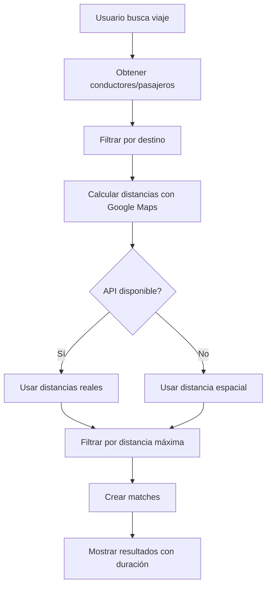

# 🗺️ Integración con Google Maps Distance Matrix API

## 📋 Resumen

Se ha implementado la integración con Google Maps Distance Matrix API para calcular distancias reales de carretera en lugar de distancias espaciales (línea recta). Esto mejora significativamente la precisión del emparejamiento entre conductores y pasajeros.

## 🚀 Características Implementadas

### ✅ **Servicio de Distancia (Frontend)**
- **Archivo**: `src/services/googleMapsDistanceService.js`
- **Funcionalidades**:
  - Cálculo de distancias reales usando Google Maps API
  - Cálculo en lote para múltiples destinos (más eficiente)
  - Cache inteligente para evitar llamadas repetidas
  - Fallback automático a distancia espacial si falla la API
  - Manejo de tráfico en tiempo real

### ✅ **Algoritmo de Emparejamiento Actualizado**
- **Frontend**: `src/hooks/useMatchmaking.js`
- **Backend**: `matchmaking_service.py`
- **Mejoras**:
  - Filtrado por destino antes del cálculo de distancia (más eficiente)
  - Cálculo de distancias en lote
  - Información de duración del viaje
  - Indicador de fuente de distancia (Google Maps vs fallback)

### ✅ **Configuración**
- **Archivo**: `env.example`
- Variables de entorno necesarias para la API

## 🔧 Configuración

### 1. **Obtener API Key de Google Maps**

1. Ve a [Google Cloud Console](https://console.cloud.google.com/)
2. Crea un nuevo proyecto o selecciona uno existente
3. Habilita la **Distance Matrix API**
4. Ve a **Credenciales** y crea una **API Key**
5. Restringe la API key a tu dominio (recomendado)

### 2. **Configurar Variables de Entorno**

Copia `env.example` a `.env` y configura:

```bash
# Frontend (React/Vite)
VITE_GOOGLE_MAPS_API_KEY=tu_api_key_aqui

# Backend (Python) - Opcional
GOOGLE_MAPS_API_KEY=tu_api_key_aqui
```

### 3. **Habilitar APIs Necesarias**

En Google Cloud Console, habilita:
- ✅ **Distance Matrix API**
- ✅ **Maps JavaScript API** (si usas mapas)
- ✅ **Places API** (si usas autocompletado)

## 📊 Comparación: Antes vs Después

### **❌ Antes (Distancia Espacial)**
```javascript
// Fórmula de Haversine - línea recta
const distance = calculateHaversineDistance(point1, point2);
// Resultado: 3.2 km (línea recta)
```

### **✅ Después (Google Maps)**
```javascript
// Distancia real de carretera
const result = await googleMapsDistanceService.calculateDistance(origin, destination);
// Resultado: { distance: 4.8, duration: "12 min", source: "google_maps" }
```

## 🎯 Beneficios de la Implementación

### **1. Precisión Mejorada**
- ✅ Distancias reales de carretera
- ✅ Considera tráfico en tiempo real
- ✅ Rutas óptimas según Google Maps

### **2. Experiencia de Usuario**
- ✅ Tiempos de viaje más precisos
- ✅ Menos matches imposibles
- ✅ Información de duración del viaje

### **3. Optimización de Rendimiento**
- ✅ Cache inteligente (5 minutos)
- ✅ Cálculo en lote para múltiples destinos
- ✅ Fallback automático si falla la API

### **4. Robustez**
- ✅ Manejo de errores completo
- ✅ Fallback a distancia espacial
- ✅ Logging detallado para debugging

## 🔍 Flujo de Emparejamiento Actualizado



## 📈 Métricas y Monitoreo

### **Logs del Sistema**
```javascript
// Ejemplo de logs generados
🚀 Iniciando emparejamiento con Google Maps...
🔍 Encontrados 3 conductores y 8 pasajeros
🚗 Procesando conductor Juan - 4 pasajeros compatibles por destino
✅ Pasajero asignado: María - 2.3km (8 min) - Fuente: google_maps
🎯 Match creado para conductor: Juan con 2 pasajeros
🎉 Emparejamiento completado: 2 matches encontrados
```

### **Estadísticas de Cache**
```javascript
// Obtener estadísticas del cache
const stats = googleMapsDistanceService.getCacheStats();
console.log(stats);
// { size: 15, maxAge: 300000, keys: [...] }
```

## 💰 Consideraciones de Costos

### **Google Maps Distance Matrix API**
- **Precio**: $5.00 por 1,000 requests
- **Optimización**: Cache de 5 minutos reduce llamadas repetidas
- **Cálculo en lote**: Hasta 25 destinos por request

### **Estimación de Costos**
```
100 usuarios activos/día × 10 búsquedas × 5 destinos promedio = 5,000 requests/día
5,000 requests × $5/1,000 = $25/día = ~$750/mes
```

## 🛠️ Mantenimiento y Troubleshooting

### **Problemas Comunes**

1. **API Key no configurada**
   ```
   ⚠️ Google Maps API key no configurada, usando distancia espacial
   ```
   **Solución**: Configurar `VITE_GOOGLE_MAPS_API_KEY` en `.env`

2. **API Key inválida**
   ```
   ❌ Error en Google Maps API: REQUEST_DENIED
   ```
   **Solución**: Verificar que la API key sea válida y tenga permisos

3. **Límite de requests excedido**
   ```
   ❌ Error en Google Maps API: OVER_QUERY_LIMIT
   ```
   **Solución**: Verificar límites en Google Cloud Console

### **Debugging**
```javascript
// Habilitar logs detallados
console.log('Cache stats:', googleMapsDistanceService.getCacheStats());
console.log('Distance result:', await googleMapsDistanceService.calculateDistance(origin, dest));
```

## 🔄 Próximos Pasos

### **Mejoras Futuras**
1. **Cache persistente**: Almacenar en base de datos
2. **Predicción de tráfico**: Usar datos históricos
3. **Optimización de rutas**: Considerar múltiples paradas
4. **Análisis de costos**: Dashboard de uso de API

### **Integración Adicional**
1. **Google Maps Directions API**: Para rutas detalladas
2. **Google Maps Places API**: Para validación de direcciones
3. **Google Maps Roads API**: Para snap a carreteras

## 📚 Referencias

- [Google Maps Distance Matrix API](https://developers.google.com/maps/documentation/distance-matrix)
- [Google Cloud Console](https://console.cloud.google.com/)
- [Distance Matrix API Pricing](https://developers.google.com/maps/billing-and-pricing/pricing#distance-matrix)

---

**Nota**: Esta implementación mantiene compatibilidad completa con el sistema anterior. Si la API de Google Maps no está disponible, el sistema automáticamente usa distancia espacial como fallback.
