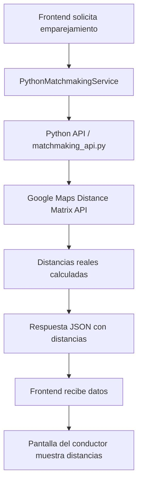

# 🐍🗺️ Integración Python + Google Maps para Distancias

## 📋 Resumen

Se ha implementado la integración entre el servicio Python de emparejamiento y Google Maps Distance Matrix API para que las distancias reales de carretera se muestren correctamente en la pantalla del conductor.

## 🔄 Flujo de Datos



## ✅ **Archivos Modificados**

### 1. **`matchmaking_api.py`** - Servicio Python Principal
- ✅ Agregadas funciones `calculate_google_maps_distance()` y `calculate_haversine_distance()`
- ✅ Actualizado el algoritmo de emparejamiento para usar Google Maps
- ✅ Respuesta JSON incluye: `distance_km`, `duration`, `distance_source`

### 2. **`matchmaking_service.py`** - Script Python Original
- ✅ Ya tenía Google Maps implementado correctamente
- ✅ Retorna distancias en el formato correcto

### 3. **`src/services/pythonMatchmakingService.js`** - Servicio Frontend
- ✅ Actualizado para manejar las distancias del Python
- ✅ Fallback de Supabase incluye distancias espaciales
- ✅ Simulaciones incluyen datos de distancia

## 📊 **Formato de Respuesta del Python**

```json
{
  "conductor_id": "driver-123",
  "nombre_conductor": "Juan Pérez",
  "pickup": "Av. Boyacá #17a-63, Bogotá, Colombia",
  "destino": "Universidad Externado",
  "pasajeros_asignados": [
    {
      "pasajero_id": "passenger-456",
      "nombre": "María García",
      "pickup": "Calle 100 #15-20, Bogotá, Colombia",
      "destino": "Universidad Externado",
      "distance_km": 2.3,
      "duration": "8 min",
      "distance_source": "google_maps"
    }
  ]
}
```

## 🖥️ **Datos en la Pantalla del Conductor**

### **Antes (Solo distancia espacial):**
```
👤 María García
📍 Desde: Calle 100 #15-20, Bogotá, Colombia
🎯 Hasta: Universidad Externado
📏 Distancia: 1.8km  ← Línea recta
```

### **Después (Google Maps):**
```
👤 María García
📍 Desde: Calle 100 #15-20, Bogotá, Colombia
🎯 Hasta: Universidad Externado
📏 Distancia: 2.3km  ← Distancia real de carretera
⏱️ Duración: 8 min   ← Tiempo con tráfico
🔍 Fuente: google_maps
```

## 🔧 **Configuración Necesaria**

### **1. Variables de Entorno**
```bash
# Para el servicio Python
GOOGLE_MAPS_API_KEY=tu_api_key_aqui

# Para el frontend (opcional)
VITE_GOOGLE_MAPS_API_KEY=tu_api_key_aqui
```

### **2. APIs de Google Maps Habilitadas**
- ✅ **Distance Matrix API**
- ✅ **Maps JavaScript API** (si usas mapas)
- ✅ **Places API** (si usas autocompletado)

## 🚀 **Cómo Probar**

### **1. Ejecutar el Servicio Python**
```bash
# Opción 1: API REST
python matchmaking_api.py

# Opción 2: Script directo
python matchmaking_service.py
```

### **2. Verificar en el Frontend**
1. Abre la aplicación
2. Inicia sesión como conductor
3. Busca pasajeros
4. Verifica que las distancias muestren:
   - Distancia real (no línea recta)
   - Tiempo de duración
   - Fuente: "google_maps"

### **3. Script de Prueba**
```bash
node test_python_distances.js
```

## 🔍 **Logs de Debugging**

### **Python (matchmaking_api.py)**
```
🚗 Processing driver: juan@example.com - Destination: Universidad Externado
✅ Matched passenger: maria@example.com - 2.3km (8 min) - Source: google_maps
🎯 Match creado para conductor: Juan con 2 pasajeros
```

### **Frontend (PythonMatchmakingService)**
```
🐍 Llamando a la API Python de matchmaking...
✅ Respuesta de la API Python: [matches con distancias]
```

### **Pantalla del Conductor**
```
🚗 Conductor aceptando pasajero: {distance_km: 2.3, duration: "8 min", distance_source: "google_maps"}
📤 Información del conductor guardada para pasajero: {trip_info: {distance_km: 2.3}}
```

## 🛡️ **Fallbacks y Robustez**

### **1. Si Google Maps API falla:**
```python
# Python automáticamente usa distancia espacial
return {
    'distance': 1.8,
    'duration': '~3 min',
    'source': 'haversine'
}
```

### **2. Si Python API no está disponible:**
```javascript
// Frontend usa fallback de Supabase con distancias espaciales
{
  distance_km: 1.8,
  duration: "~3 min",
  distance_source: "spatial_fallback"
}
```

### **3. Si no hay API key:**
```python
# Python detecta automáticamente y usa fallback
logger.warning("⚠️ Google Maps API key no configurada, usando distancia espacial")
```

## 📈 **Beneficios de la Implementación**

### **✅ Precisión Mejorada**
- Distancias reales de carretera
- Tiempos de viaje con tráfico
- Rutas óptimas según Google Maps

### **✅ Experiencia de Usuario**
- Conductores ven distancias precisas
- Pasajeros reciben información realista
- Menos matches imposibles

### **✅ Robustez**
- Fallback automático si falla Google Maps
- Logging detallado para debugging
- Compatibilidad con sistema anterior

## 🔧 **Troubleshooting**

### **Problema: Distancias siguen siendo espaciales**
```bash
# Verificar que Python esté usando Google Maps
python matchmaking_service.py

# Verificar logs:
# ✅ Pasajero asignado: María - 2.3km (8 min) - Fuente: google_maps
```

### **Problema: API Python no responde**
```bash
# Verificar que el servicio esté ejecutándose
curl http://localhost:5000/api/python-matchmaking

# Verificar logs del frontend:
# ❌ Error en API Python: No se pudo conectar
# 🔄 Cambiando a fallback de Supabase...
```

### **Problema: Google Maps API falla**
```bash
# Verificar API key
echo $GOOGLE_MAPS_API_KEY

# Verificar logs de Python:
# ⚠️ Google Maps API key no configurada, usando distancia espacial
```

## 📚 **Referencias**

- [Google Maps Distance Matrix API](https://developers.google.com/maps/documentation/distance-matrix)
- [Python Flask API](https://flask.palletsprojects.com/)
- [Supabase JavaScript Client](https://supabase.com/docs/reference/javascript)

---

**Nota**: Esta implementación mantiene compatibilidad completa con el sistema anterior. Si Google Maps no está disponible, el sistema automáticamente usa distancia espacial como fallback.
